# MedLine DBA Resit Project

Student ID: 32116055  
Student email: 32116055@student.uwl.ac.uk

This repository contains the code, dataset, outputs and final report for the Databases and Analytics resit assignment based on the MedLine Community Healthcare and Appointment Services case study.

The project analyses appointment outcomes, waiting times, clinic performance, referral delays, prescription delays, nurse visit issues, patient feedback and digital service cases. The final work is organised into three Google Colab notebooks covering SQL in R, R analytics, Python data processing, MongoDB Atlas and query optimisation.

## Repository Structure

```text
medline-dba-resit/
|-- README.md
|-- requirements.txt
|-- .gitignore
|-- medline_resit_dataset/
|-- notebooks/
|   |-- 01_R_SQL_and_R_Analytics.ipynb
|   |-- 02_Python_Data_Processing.ipynb
|   `-- 03_MongoDB_Atlas_and_Optimisation.ipynb
|-- outputs/
|   |-- figures/
|   |-- mongodb/
|   `-- tables/
`-- reports/
    `-- MedLine_Resit_Submission_Report_FINAL_SUBMISSION.docx
```

## Notebooks

| Notebook | Purpose |
|---|---|
| `01_R_SQL_and_R_Analytics.ipynb` | Loads CSV files into SQLite from R, runs SQL queries, demonstrates CRUD, checks query plans and produces R analytics charts. |
| `02_Python_Data_Processing.ipynb` | Main Python workflow for loading, cleaning, validating, merging, feature creation, EDA tables and charts. |
| `03_MongoDB_Atlas_and_Optimisation.ipynb` | Imports nested JSONL service cases into MongoDB Atlas, runs CRUD, aggregation pipelines, indexes, timing tests and explain-plan checks. |

## Dataset

The dataset is stored in `medline_resit_dataset/` and includes patients, clinics, staff, appointments, referrals, prescriptions, nurse visits, patient feedback, digital interactions and nested patient service cases.

| Dataset | Rows | Columns |
|---|---:|---:|
| patients | 250 | 7 |
| clinics | 6 | 6 |
| staff | 60 | 5 |
| appointments | 700 | 10 |
| referrals | 250 | 8 |
| prescriptions | 400 | 9 |
| nurse_visits | 300 | 9 |
| patient_feedback | 350 | 8 |
| digital_interactions | 719 | 10 |

## Example Code Snippets

Python was used to create a single appointment problem flag by combining cancellations and no-shows:

```python
appointments["bad_outcome"] = appointments["status"].isin([
    "Cancelled by patient",
    "Cancelled by clinic",
    "No-show"
])
```

SQL in R was used to calculate clinic-level appointment performance:

```sql
SELECT
    c.clinic_name,
    COUNT(*) AS total_appointments,
    SUM(CASE WHEN a.status IN
        ('Cancelled by patient', 'Cancelled by clinic', 'No-show')
        THEN 1 ELSE 0 END) AS bad_outcomes
FROM appointments a
JOIN clinics c ON a.clinic_id = c.clinic_id
GROUP BY c.clinic_name;
```

MongoDB was used for nested patient service cases:

```python
collection.update_one(
    {"case_id": "C_TEST_DEMO"},
    {"$set": {"case_status": "Escalated"}}
)
```

## Key Output Tables

### Appointment Status

| Status | Appointments | Percentage |
|---|---:|---:|
| Completed | 427 | 61.00% |
| Cancelled by patient | 86 | 12.29% |
| Cancelled by clinic | 83 | 11.86% |
| Rescheduled | 53 | 7.57% |
| No-show | 51 | 7.29% |

### Clinic Appointment Performance

| Clinic | Appointments | Bad outcomes | Bad outcome rate |
|---|---:|---:|---:|
| Canal Walk Clinic | 127 | 52 | 40.94% |
| Riverside Clinic | 127 | 46 | 36.22% |
| Northgate Diagnostics | 130 | 41 | 31.54% |
| Green Park Health Centre | 96 | 27 | 28.13% |
| Westbridge Community Clinic | 117 | 32 | 27.35% |
| Hillview Medical Hub | 103 | 22 | 21.36% |

### Service Appointment Performance

| Service type | Appointments | Bad outcomes | Bad outcome rate |
|---|---:|---:|---:|
| Prescription Review | 126 | 43 | 34.13% |
| Diagnostic Scan | 123 | 40 | 32.52% |
| Nurse Appointment | 117 | 37 | 31.62% |
| Blood Test | 111 | 34 | 30.63% |
| Community Follow-up | 119 | 36 | 30.25% |
| GP Consultation | 104 | 30 | 28.85% |

### Referral Delay by Service

| Target service | Referrals | Delayed or open | Delayed/open rate |
|---|---:|---:|---:|
| Cardiology | 45 | 23 | 51.11% |
| Community Nursing | 53 | 25 | 47.17% |
| Physiotherapy | 38 | 17 | 44.74% |
| Dermatology | 42 | 16 | 38.10% |
| Diagnostics | 35 | 11 | 31.43% |
| Mental Health | 37 | 11 | 29.73% |

## Main Charts

### Appointment and Clinic Analysis

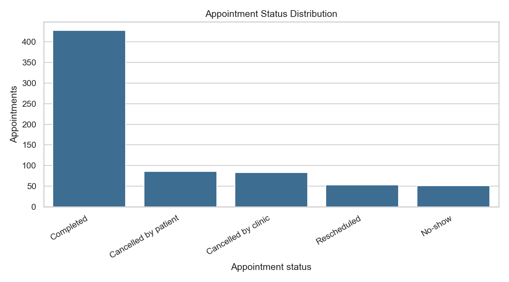

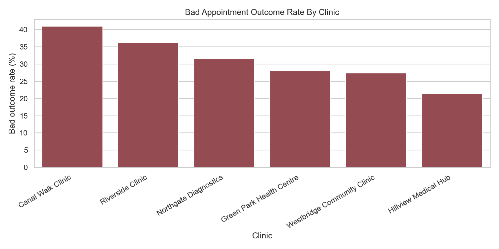

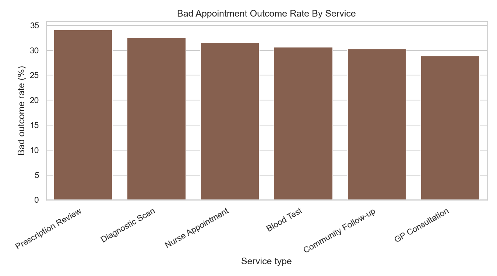

### Waiting Time and Feedback Analysis

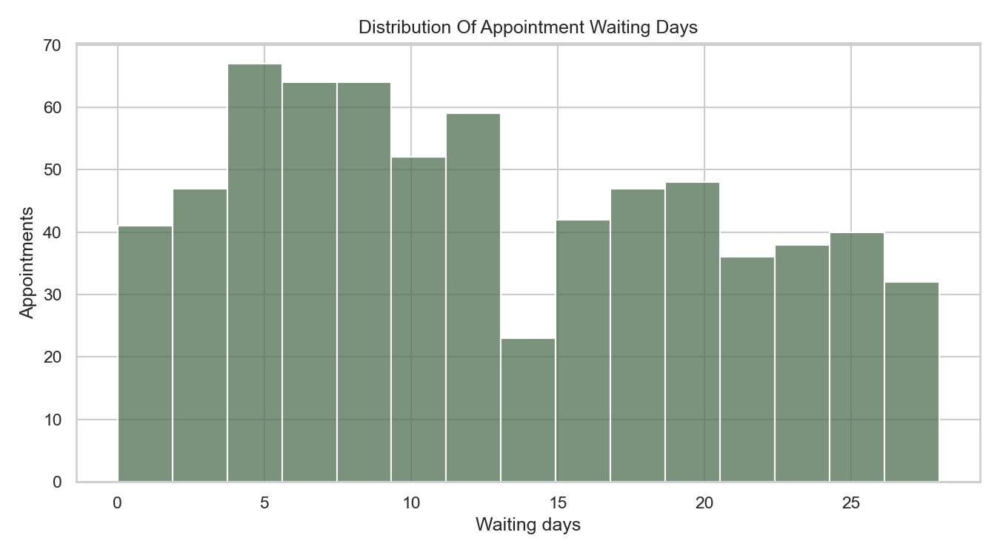

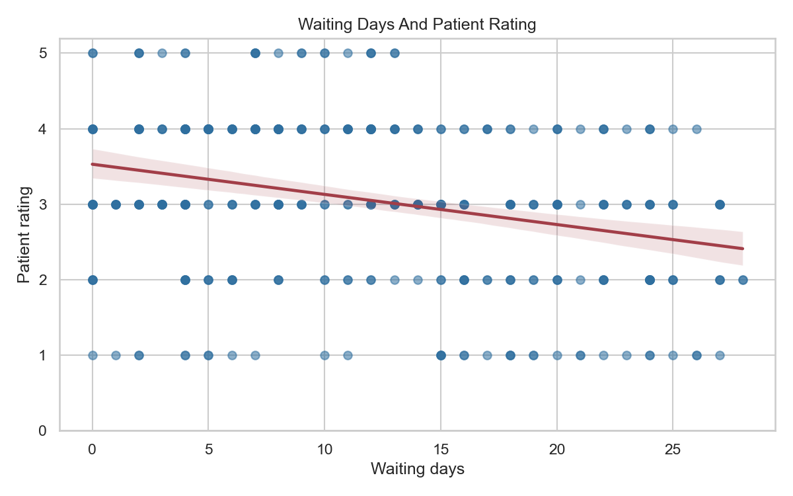

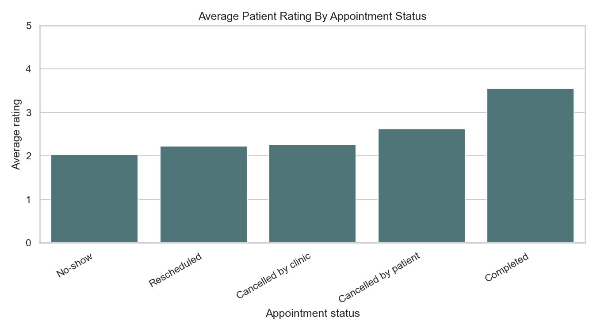

The waiting-days and rating correlation was approximately `-0.291`, showing that longer waits were generally linked with lower patient ratings.

### Referral, Prescription and Nurse Visit Analysis

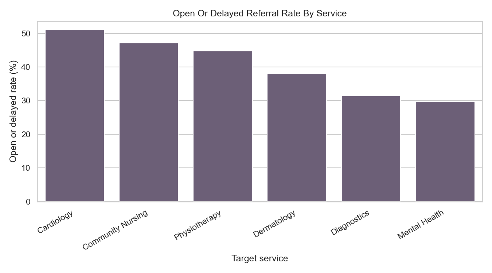

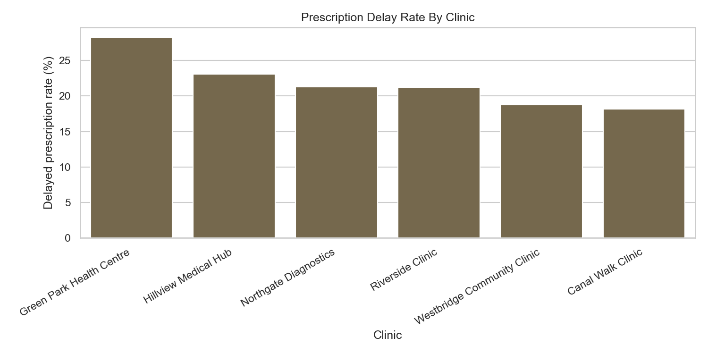

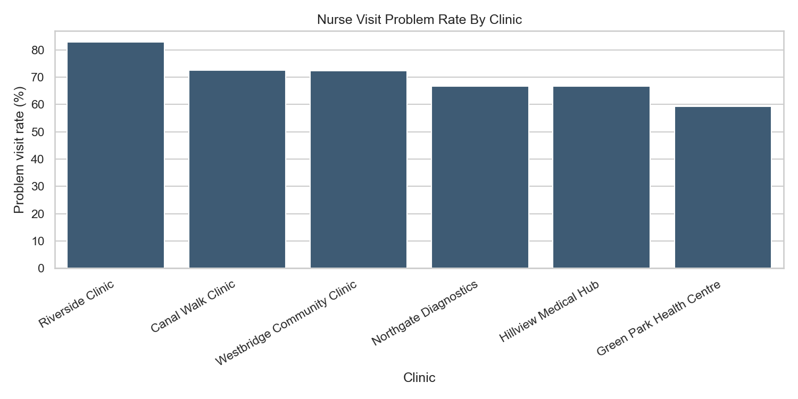

### Combined Risk and Digital Interaction Analysis

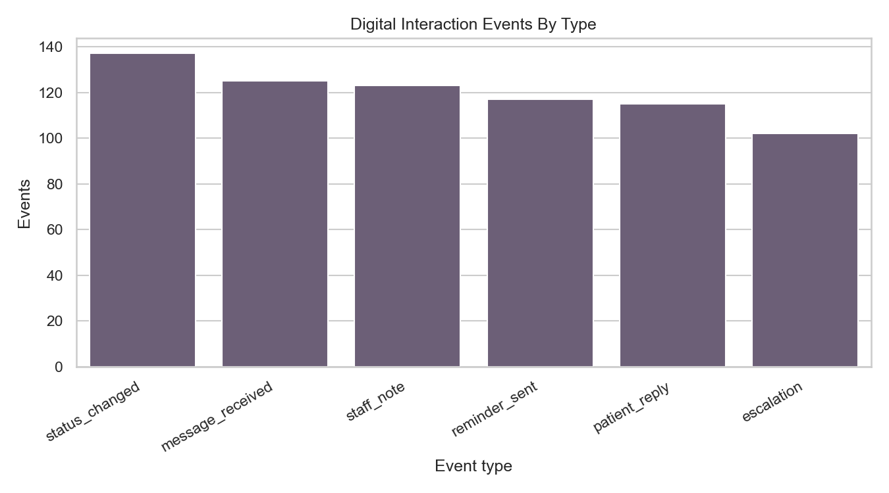

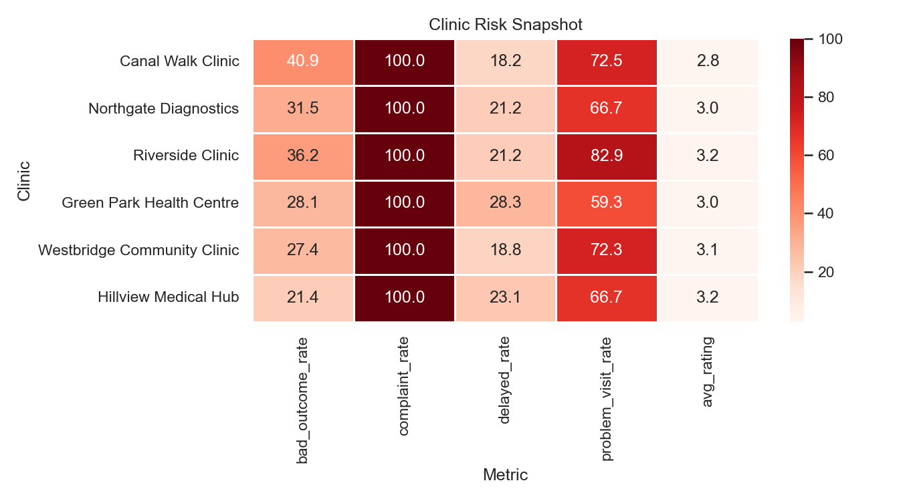

## MongoDB Output

The MongoDB notebook creates the `medline_resit` database and the `patient_service_cases` collection. The JSONL file contains 180 nested service case documents and 719 nested events.

| MongoDB evidence | Result |
|---|---|
| Database | `medline_resit` |
| Collection | `patient_service_cases` |
| Documents inserted | 180 |
| Main model | Nested patient service case documents |
| Optimisation evidence | Indexes, repeated timing tests and explain-plan notes |

The explain-plan output confirms index use for the main workloads:

| Workload | Uses IXSCAN | Uses COLLSCAN |
|---|---|---|
| open_high_priority_cases | True | False |
| patient_case_history | True | False |
| escalation_event_cases | True | False |

## Outputs Included

| Folder | Contents |
|---|---|
| `outputs/figures/` | PNG charts used in the analysis and report |
| `outputs/tables/` | CSV summary tables from R, Python and MongoDB workflows |
| `outputs/mongodb/` | Aggregation pipelines, aggregation results, query workloads and explain-plan JSON files |
| `reports/` | Final Word report for submission |

## How To Run

1. Open `notebooks/01_R_SQL_and_R_Analytics.ipynb` in Google Colab using an R runtime.
2. Open `notebooks/02_Python_Data_Processing.ipynb` in Google Colab using a Python runtime.
3. Open `notebooks/03_MongoDB_Atlas_and_Optimisation.ipynb` in Google Colab using a Python runtime.

The notebooks use relative paths, so keep `medline_resit_dataset/`, `notebooks/`, `outputs/` and `reports/` in the same repository structure.

For local Python use:

```bash
pip install -r requirements.txt
```

For the MongoDB notebook, add the Atlas connection string in Colab as `MONGODB_URI` before running the MongoDB cells.
